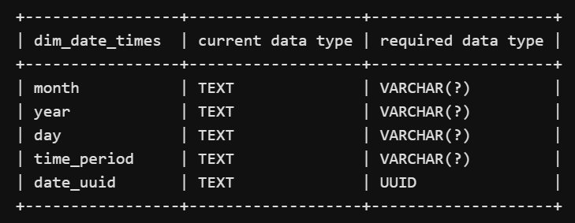
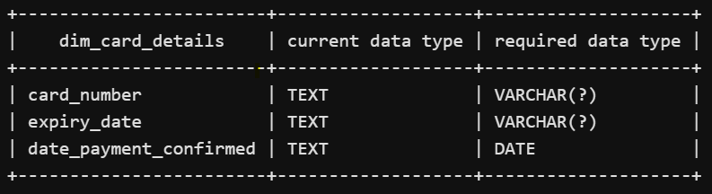
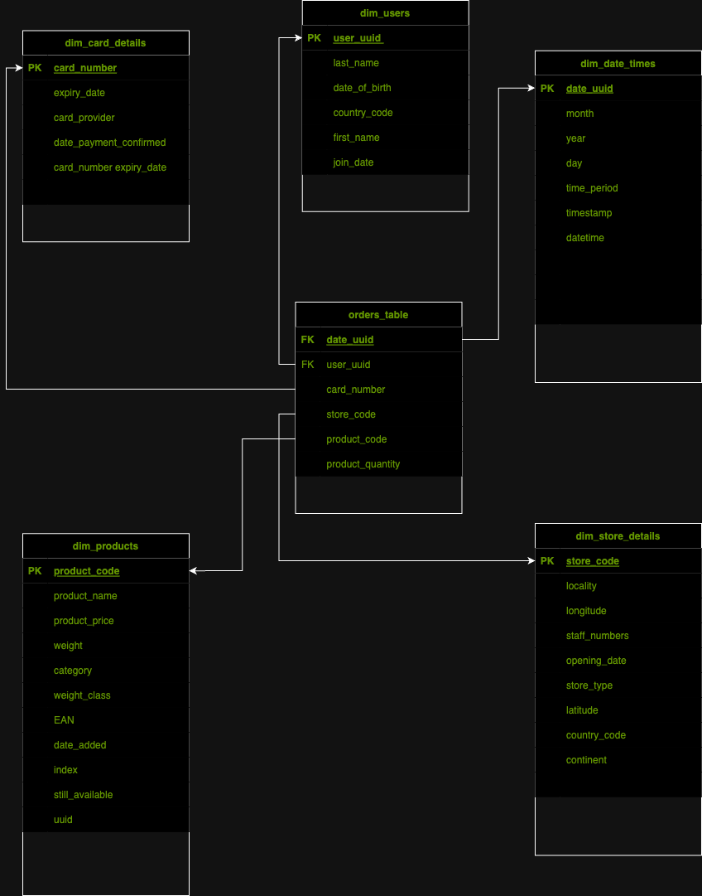

# Multinational-Retail-Data-Centralisation

# Project Description

This project mimics an ideal ETL project for a multinational company that sells various goods across the globe.

In this scenerio, their sales data is spread across many different data sources making it not easily accessible or analysable by current members of the team. In an effort to become more data-driven, the organisation would like to make its sales data accessible from one centralised location.

The goal of the project will be to produce a system that stores the current company data in a database so that it's accessed from one centralised location and acts as a single source of truth for sales data.

The user will then query the database to get up-to-date metrics for the business.

# File Structure

## Milestones 2 : Code Description

- `data_extraction.py` : used to extract data from different data sources

- `database_utils.py` : used to connect with and upload data to the database

- `data_cleaning.py` : used to clean data from each of the data sources

## Milestones 3 : Code Description

- `task_1.sql` : casts the column in the `orders_table` to appopriate datatypes as shown
    <div align="center">
    
    </div>

- `task_2.sql` : casts the column in the `users_table` to appopriate datatypes as shown
    <div align="center">
    
    </div>

- `task_3.sql` : casts the column in the `dim_stores_table` to appopriate datatypes as shown
    <div align="center">
    
    </div>

- `task_4.sql` : add the column `weight_category` in the `dim_products` table

- `task_5.sql` : casts the column in the `dim_products` to appopriate datatypes as shown
    <div align="center">
    
    </div>

- `task_6.sql` : casts the column in the `dim_date_times` to appopriate datatypes as shown
    <div align="center">
    
    </div>

- `task_7.sql` : casts the column in the `dim_card_details` to appopriate datatypes as shown
    <div align="center">
    
    </div>

- `task_8.sql` : set primary keys for all of the dimensional tables with accordance to the ERD diagram below
    <div align="center">
    
    </div>

- `task_9.sql` : add foreign keys to the `orders_table`

## Milestones 4 : Code Description

- `task_1.sql` : finds the amount of stores in each country

- `task_2.sql` : finds locations which have the most stores

- `task_3.sql` : finds which months produce the highest cost of sales typically

- `task_4.sql` : compares sales and products offline vs online

- `task_5.sql` : computes percentage of sales per store type

- `task_6.sql` : finds which months in each year produce the highest cost of sales

- `task_7.sql` : finds the overall staff numbers in each location around the world

- `task_8.sql` : finds stores with highest sales in Germany

- `task_9.sql` : computes the average time taken between each sale grouped by year

# License information

GNU General Public License

# Installation Requirements

- Pandas : !pip install pandas
- SQLAlchemy : !pip install SQLAlchemy
- Psycopg2 : !pip install psycopg2
- Tabula : !pip install tabula-py
- Requests : !pip install requests
- Boto3 : !pip install boto3

# Usage instructions
```
- The individual databases can be obtained and cleaned by instantating the DataCleaning class as shown

from data_cleaning import DataCleaning
datacleaner = DataCleaning()

users_df = datacleaner.clean_user_data()
orders_df = datacleaner.clean_orders_data()
cards_table = datacleaner.clean_card_data()
stores_df = datacleaner.called_clean_store_data()
products_df = datacleaner.clean_products_data()
events_df = datacleaner.clean_event_date_data
```
- These can be uploaded unto your local Postgres space as follows
```
from database_utils import DatabaseConnector
connector = DatabaseConnector()
connector.upload_to_db(<table_name>)
```
- Note you'd require your credentials for both an AWS account, a postgres local space and API key for some of the private and restricted databases


# Some keynotes learned from this project

- When listing table names from SQL alchemy, it is more computationally to use the Inspector object as opposed to the MetaData class. The Metadata object holds collection of table info, their data types, schema names etc

- however MetaData() includes thread safety -> meaning it can handle concurrent tasks from multiple thread (computationally efficient when multiple threads need access to same resource) `Reference: ` obtained from here : https://docs.sqlalchemy.org/en/20/core/metadata.html

- A `FacadeDict` : basically it is like Python's default Dict() datastrucutre, SQLAlchemy claims it is more efficient for lookup and management. Since there is no resource that compares the two, the claim that `Facade` is better is clearly, in itself, a facade :)

- However, SQLAlchemy claims it to be publically immutable, hence it is probably more secure to use, `Reference: ` https://pydoc.dev/sqlalchemy/latest/sqlalchemy.util._collections.FacadeDict.html

- Using a column that has unique characters is ideal for sorting out alphanumeric presence, so it was a mistake remove special symbols first, it is best to leave this processing step until later!!

- Always wise to check consistency before changing any format of data, if the format is persistent, no need to change it

- Changing column types using ALTER TABLE directly changed values of columns with TEXT type, so a better method was to use CAST and then DROP the former and upload the newer

- In PostgresSQL, you can select columns that have special characters in them by using double quotes, for example `SELECT "price ($)" FROM tableX`, this is different to TransactSQL where you'd ideally use square brackets for example `SELECT [price ($)] FROM tableX`

- Also in PostgresSQL, when using `CASE` statement, double quotes are reserved for columnar names, single quotes for string/text/varchar output

- N.B: On PC be sure to have latest Pandas version and sqlalchemy==1.4.46 for successfull connection, On Mac all versions are acceptable

# #TODO : for improving code in future (quality and performance)

- Re-run task 3 miletone 2 with Inspector object, use %%time magic func. to compare performance with MetaData object in SQLAlchemy
- Change the ERD to show relationships

# Resources

- SQLAlchemy common commands : https://towardsdatascience.com/sqlalchemy-python-tutorial-79a577141a91
